# STCNet
This repository provides the code for the paper "STCNet: Spatio-Temporal Cross Network for Industrial Smoke Detection".

# Environment
Python 3.6

Pytorch 1.3+

# Experiments

F-Scores for some methods on RISE dataset.

Model  | 	S0	| S1  | 	S2  | 	S3  | 	S4  | 	S5  | 	Average
--- |--- |--- |--- |--- |--- |--- |---
Flow-SVM | .42 | .59 | .47 | .63 | .52 | .47 | .517
Flow-I3D | .55 | .58 | .51 | .68 | .65 | .50 | .578
RGB-SVM | .57 | .70 | .67 | .67 | .57 | .53 | .618
RGB-I3D | .80 | .84 | .82 | .87 | .82 | .75 | .817
RGB-I3D-ND | .76 | .79 | .81 | .86 | .76 | .68 | .777
RGB-I3D-FP | .76 | .81 | .82 | .87 | .81 | .71 | .797
RGB-I3D-TSM | .81 | .84 | .82 | .87 | .80 | .74 | .813
RGB-I3D-LSTM | .80 | .84 | .82 | .85 | .83 | .74 | .813
RGB-I3D-NL | .81 | .84 | .83 | .87 | .81 | .74 | .817
RGB-I3D-TC | .81 | .84 | .84 | .87 | .81 | .77 | .823
Plain SE-Resnext | .83 | .82 | .84 | .85 | .78 | .83 | .826
STCNet(MobileNetv2) | .86 | .88 | .87 | .89 | .84 | .86 | .868
STCNet(SE-ResNext) | .88 | .89 | .90 | .90 | .86 | .88 | .885

Compare with other methods on RISE dataset. (RTX2080Ti GPU)

Model | Backbone | Params | Flops | Latency | Throughput | Average
--- |--- |--- |--- |--- |--- |---
RGB-I3D | Inception I3D | 12.3M | 62.7G | 30.56ms | 32.71vid/s | .817
RGB-I3D-TSM | Inception I3D | 12.3M | 62.7G | 31.85ms | 31.40vid/s | .813
RGB-I3D-LSTM | Inception I3D | 38.0M | 62.9G | 31.01ms | 32.25vid/s | .813
RGB-I3D-NL | Inception I3D | 12.3M | 62.7G | 30.32ms | 32.98vid/s | .817
RGB-I3D-TC | Inception I3D | 12.3M | 62.7G | 30.41ms | 32.88vid/s | .823
Plain SE-Resnext | SE-ResNeXt-50 | 26.6M | 34.4G | 22.10ms | 45.25vid/s | .826
STCNet (Proposed) | Mobilenetv2 | 3.7M | 2.4G | 9.12ms | 109.7vid/s | .868
STCNet (Proposed) | SE-ResNeXt-50 | 27.2M | 34.6G | 23.49ms | 42.57vid/s | .885

# Visualization

Input RGB frames (the top row) in RISE dataset and corresponding residual frames (the bottom row)

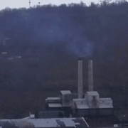
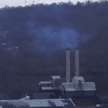
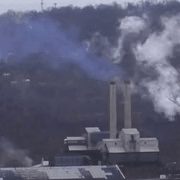
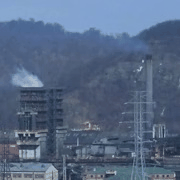

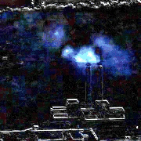
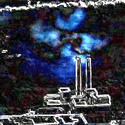
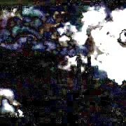

Grad-CAM visualization for spatial and temporal pathway.

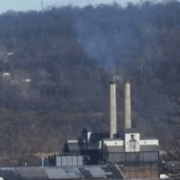

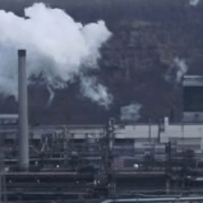
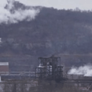

GRAD-CAM visualization of Spatial path:

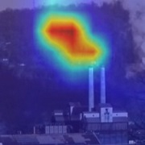
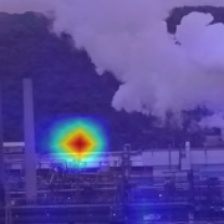
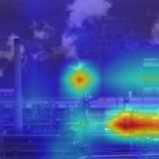
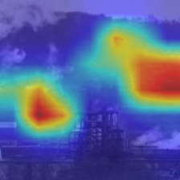

GRAD-CAM visualization of Temporal path:

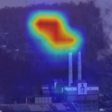
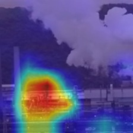

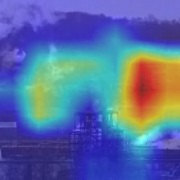

False positive cases in the testing set.

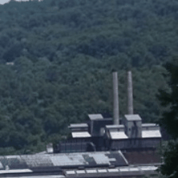
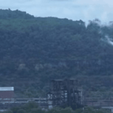
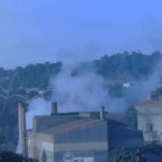
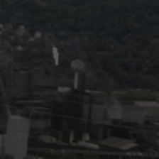

False negative cases in the testing set. 

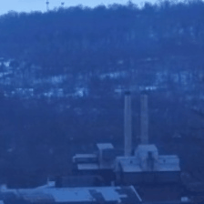

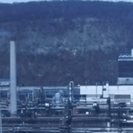

Each GIF has the same name as the original video. If interested, you can check the corresponding original video in RISE dataset:
https://github.com/CMU-CREATE-Lab/deep-smoke-machine

# Acknowledgements
We thank Carnegie Mellon University (CMU) and Pennsylvania State University (PSU) for their efforts in environmental protection. We also thank the Big Data Center of Southeast University for providing the facility support on the numerical calculations in this paper.

And this is a good implementation for our method:
https://github.com/ChangyWen/STCNet-for-Smoke-Detection

# Citation
If you use our code or paper, please cite:

Y. Cao, Q. Tang, X. Lu, F. Li, and J. Cao, “STCNet: Spatio-Temporal Cross Network for Industrial Smoke Detection,” arXiv:2011.04863 [cs], Nov. 2020, Accessed: Nov. 16, 2020. [Online]. Available: http://arxiv.org/abs/2011.04863.

# Contact
If you have any question, please feel free to contact me (Yichao Cao, caoyichao@seu.edu.cn). Thanks :-)

