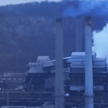
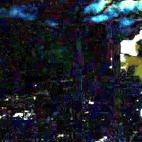

# STCNet
STCNet: Spatio-Temporal Cross Network for Industrial Smoke Detection

The code will be available soon.

Input RGB frames (the top row) in RISE dataset and corresponding residual frames (the bottom row)

Grad-CAM visualization for spatial and temporal pathway.

False positive cases in the testing set.

False negative cases in the testing set. 
